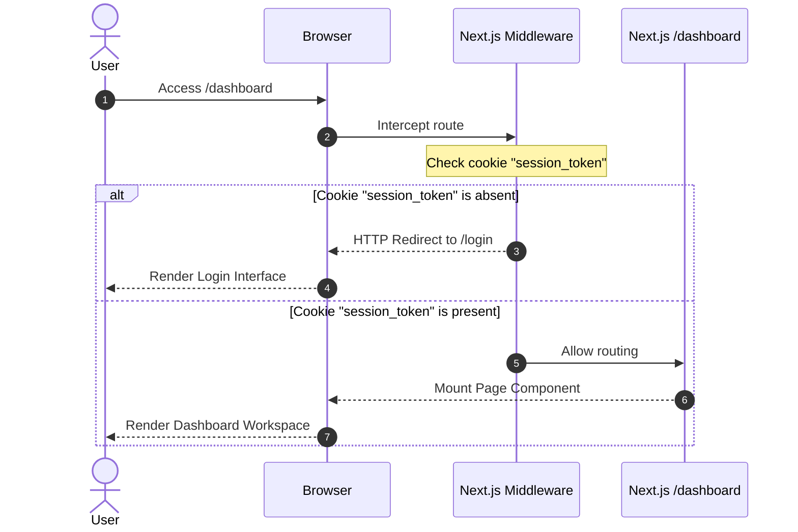
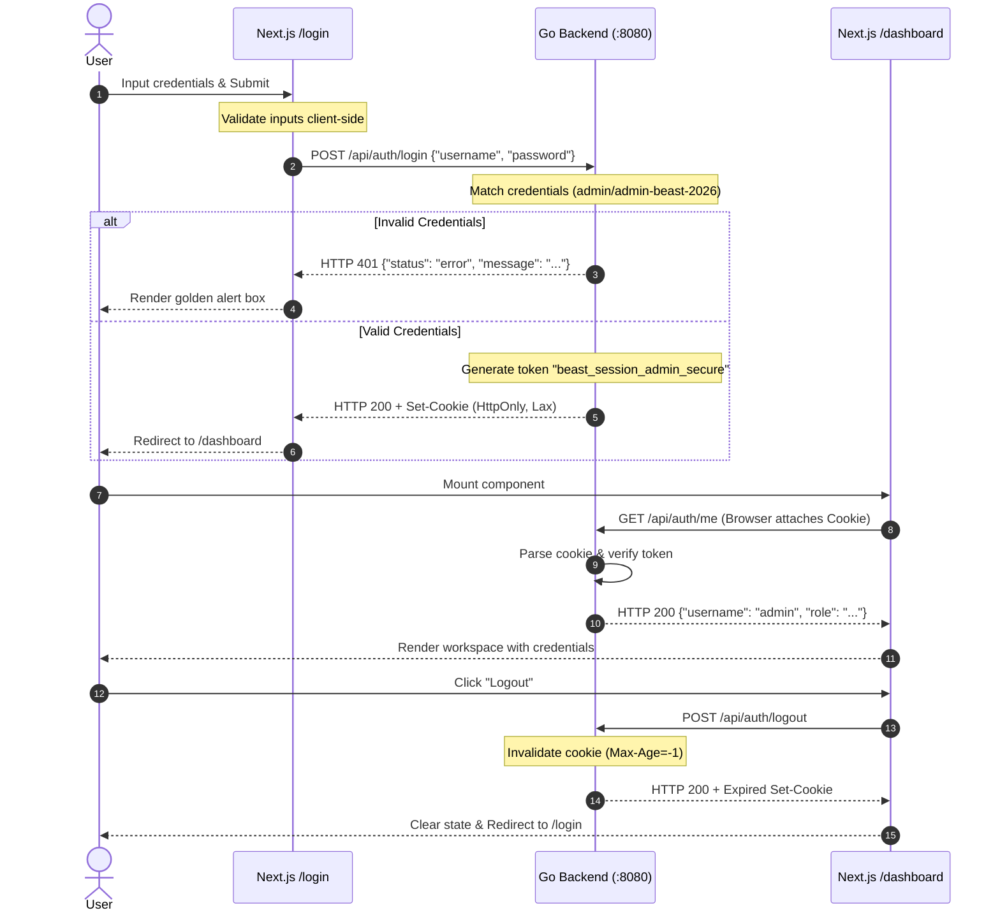

# Technical Design: Simple Authentication System

This document outlines the software design, sequence flows, file mapping, and test architecture of the authentication implementation.

---

## 1. Sequence Flows

### 1.1 Unauthenticated Route Protection



### 1.2 Authentication Lifecycle (Login -> Fetch Info -> Logout)



---

## 2. File Organization & Component Map

We will map out the precise additions to both backend and frontend structures:

```
beast-driven-development/
├── backend/
│   ├── main.go                # Wire route handlers in serving MUX
│   ├── main_test.go           # Keep main_test synchronized
│   ├── auth.go                # [NEW] Contains Login, Logout, Me handlers & Cookie utils
│   └── auth_test.go           # [NEW] Unit tests covering all authentication handlers
└── frontend/
    └── src/
        ├── middleware.ts      # [NEW] Edge middleware for route guarding
        └── app/
            ├── login/
            │   └── page.tsx   # [NEW] Pitch-black, glassmorphic login interface
            └── dashboard/
                └── page.tsx   # [NEW] Protected developer workspace view
```

---

## 3. Implementation Details

### 3.1 Backend Go Handlers (`backend/auth.go`)
- **Session Token**: `beast_session_admin_secure`
- **Expected Credentials**:
  - `Username`: `admin`
  - `Password`: `admin-beast-2026`
- **Cookie Setup**:
  - Name: `session_token`
  - Path: `/`
  - SameSite: `Lax`
  - HttpOnly: `true`
  - MaxAge: `86400` (24 Hours)

### 3.2 Frontend Route Guards (`frontend/src/middleware.ts`)
- The Next.js edge middleware parses standard request cookies.
- If path starts with `/dashboard` and `session_token` is missing -> rewrite or redirect to `/login`.
- If path starts with `/login` and `session_token` is active -> redirect to `/dashboard`.

### 3.3 Dark Premium Styling Tokens (`frontend/src/app/login/page.tsx`)
- Canvas background: `bg-black` or `bg-zinc-950` with a subtle grid pattern or golden glow:
  - Custom radial gradient: `radial-gradient(circle at 50% 50%, rgba(217, 119, 6, 0.05) 0%, transparent 60%)`.
- Login Card: `bg-zinc-900/60 backdrop-blur-md border border-zinc-800/80 rounded-2xl shadow-2xl shadow-black/50`.
- Form controls:
  - Input base: `bg-zinc-950 border border-zinc-800 text-white rounded-lg px-4 py-3 outline-none transition-all duration-300`.
  - Focus state: `focus:border-amber-500 focus:ring-1 focus:ring-amber-500/30`.
  - Button state: `bg-amber-600 hover:bg-amber-500 text-black font-semibold tracking-wide rounded-lg py-3 transition-all duration-300 transform active:scale-95 shadow-lg shadow-amber-900/20`.

---

## 4. Test Strategy (Strict TDD)

We will adhere strictly to test-first design:

### 4.1 Backend (Go unit tests)
Tests will be defined in `backend/auth_test.go` and verified via `go test -v`.
- **`TestLoginHandler_Success`**: Verifies valid credentials yield `200 OK` and the appropriate `Set-Cookie` header.
- **`TestLoginHandler_Failure`**: Verifies incorrect credentials return `401 Unauthorized`.
- **`TestMeHandler_Authorized`**: Verifies providing the session token cookie returns the user details.
- **`TestMeHandler_Unauthorized`**: Verifies requesting without a cookie returns `401`.
- **`TestLogoutHandler`**: Verifies logging out invalidates the session token cookie.

### 4.2 Frontend (Vitest + React Testing Library)
Tests will run on `frontend/` using Vitest.
- **Login Visuals**: Renders the glassmorphic container and controls properly.
- **Login Validation**: Verifies entering malformed or empty fields alerts the user immediately.
- **Login Submission**: Verifies submitting coordinates an API request, changes button state, and redirects upon success.
- **Dashboard Display**: Renders workspace controls and correctly calls for active profile data.
