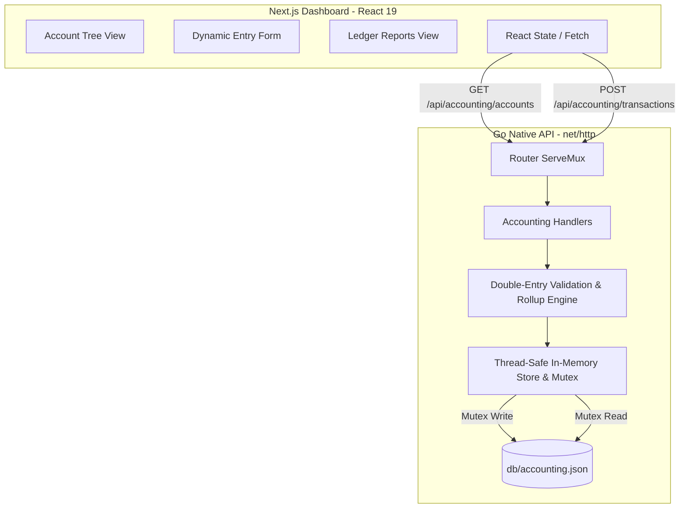

# Technical Design: ERP Nodo Sur Accounting Core (`zenerp-core`)

This document defines the technical architecture, data structures, and implementation plan for the ERP Nodo Sur Accounting module. It ensures a robust, double-entry constraint system with a dynamic hierarchical chart of accounts and real-time ledger report capabilities under strict TDD guidelines.

---

## 1. System Architecture



---

## 2. Backend Architecture & Design (Go)

### Data Models & JSON Representation

We define the primary structs inside the Go backend. All field validation and persistence checks are governed by thread-safe operations.

#### Account Struct
Represents an accounting account in the hierarchical Chart of Accounts (Plan de Cuentas).
```go
type Account struct {
	Code       string  `json:"code"`        // Unique code e.g. "1", "1.1", "1.1.01"
	Name       string  `json:"name"`        // Account name e.g. "Caja"
	ParentCode string  `json:"parent_code"` // Parent account code e.g. "1.1" (empty for roots)
	Type       string  `json:"type"`        // "asset" | "liability" | "equity" | "revenue" | "expense"
	Balance    float64 `json:"balance"`     // Calculated dynamically during fetch (rollup of children + direct)
}
```

#### Entry Struct
A single line within a double-entry transaction.
```go
type Entry struct {
	AccountCode string  `json:"account_code"` // Target account code
	Debe        float64 `json:"debe"`         // Debit amount (>= 0)
	Haber       float64 `json:"haber"`         // Credit amount (>= 0)
}
```

#### Transaction Struct
A full balanced transaction (Asiento Contable).
```go
type Transaction struct {
	ID          string  `json:"id"`          // Unique transaction ID (e.g., tx_1)
	Date        string  `json:"date"`        // Date in ISO format "YYYY-MM-DD"
	Description string  `json:"description"` // User-provided description
	Entries     []Entry `json:"entries"`     // List of split ledger lines
}
```

### JSON Schema (`backend/db/accounting.json`)
```json
{
  "accounts": [
    { "code": "1", "name": "Activo", "parent_code": "", "type": "asset" },
    { "code": "1.1", "name": "Activo Corriente", "parent_code": "1", "type": "asset" },
    { "code": "1.1.01", "name": "Caja General", "parent_code": "1.1", "type": "asset" },
    { "code": "3", "name": "Patrimonio", "parent_code": "", "type": "equity" },
    { "code": "3.1", "name": "Capital", "parent_code": "3", "type": "equity" },
    { "code": "3.1.01", "name": "Capital Social", "parent_code": "3.1", "type": "equity" }
  ],
  "transactions": [
    {
      "id": "tx_1",
      "date": "2026-05-17",
      "description": "Initial Capital Contribution",
      "entries": [
        { "account_code": "1.1.01", "debe": 10000.0, "haber": 0.0 },
        { "account_code": "3.1.01", "debe": 0.0, "haber": 10000.0 }
      ]
    }
  ]
}
```

### Dynamic Rollup Engine

To calculate account balances dynamically, the engine executes the following logic during Plan de Cuentas retrieval:
1. **Initialize Base Balances**:
   - For each account, initialize `BaseBalance = 0`.
   - Iterate through all transactions and accumulate the base balance for the exact matched `account_code`.
   - Asset/Expense: `BaseBalance += Debe - Haber`.
   - Liability/Equity/Revenue: `BaseBalance += Haber - Debe`.
2. **Propagate Rollups (Hierarchical Rollup)**:
   - Sort accounts by depth of code descending (e.g., length of string, or count of subdivisions like `1.1.01` -> depth 3, `1.1` -> depth 2, `1` -> depth 1).
   - For each account, dynamically aggregate its base balance + the balance of all child accounts that have its code as a prefix.
   - For example, `1. Activo` balance is the sum of `1.1 Caja` + `1.2 Bancos` + its own direct entries.

### Validation Engine

When a transaction is posted (`POST /api/accounting/transactions`), the following constraints are executed atomically:
1. **Double-Entry Balance Constraint**:
   $$\sum \text{Debe} == \sum \text{Haber}$$
   Within floating point tolerances (e.g., `math.Abs(sumDebe - sumHaber) < 0.0001`). If unbalanced, return HTTP 400 with a detailed error.
2. **At Least Two Entries**: Must contain at least 2 entries.
3. **Valid Account Codes**: All target `account_code` elements must exist.
4. **Positive Values**: Debe and Haber values must be non-negative ($\ge 0$). At least one must be $> 0$.

When an account deletion is requested:
1. **No Active Children**: If the account code is a prefix to any other existing account code, block deletion.
2. **No Postings**: If the account code has entries in `transactions`, block deletion.

### Router & Endpoints (`backend/main.go`)
We will register these routes in the `ServeMux`:
```go
mux.HandleFunc("GET /api/accounting/accounts", handleGetAccounts)
mux.HandleFunc("POST /api/accounting/accounts", handleCreateAccount)
mux.HandleFunc("DELETE /api/accounting/accounts", handleDeleteAccount)
mux.HandleFunc("POST /api/accounting/transactions", handlePostTransaction)
mux.HandleFunc("GET /api/accounting/reports/diario", handleReportDiario)
mux.HandleFunc("GET /api/accounting/reports/mayor", handleReportMayor)
mux.HandleFunc("GET /api/accounting/reports/balance", handleReportBalance)
```

---

## 3. Frontend Architecture & Design (Next.js)

The user interface will be developed as a cohesive, high-craft, ERP Nodo Sur dashboard nested inside `frontend/src/app/dashboard`. We will introduce a premium split-tab layout for Ledger Reports and Account Configuration.

### ERP Nodo Sur Premium Design System
We follow the established dark aesthetic:
- **Background**: `bg-neutral-950`
- **Surface**: `bg-neutral-900/40 backdrop-blur-xl border border-neutral-900`
- **Primary Highlights**: Jade Green `emerald-500` (representing ERP Nodo Sur brand guidelines), instead of standard blue or purple.
- **Accents**: Subtle amber-gold `amber-500/20` shadows and ambient glows.
- **Typography**: Mono-spaced columns for perfect alignment of numeric figures.

### Core Frontend Components

1. **Plan de Cuentas Collapsible Tree (`AccountTree.tsx`)**:
   - Displays hierarchical structural tree with indentations.
   - Interactive toggles to expand/collapse parent groups.
   - In-line action to add child account under any code.
   - Safe deletion trigger (red trash icons disabled for parent accounts or active posting nodes).

2. **Real-time Balanced Asiento Form (`TransactionForm.tsx`)**:
   - Dynamic rows utilizing React state arrays.
   - Select element for account codes, input fields for description, debit, and credit.
   - **Real-Time Live Balance Indicator**:
     - Red badge: `Unbalanced: Debe $X.XX != Haber $Y.YY (Diff: $Z.ZZ)`
     - Jade Green badge: `✓ Perfectly Balanced ($X.XX)`
   - Post button remains disabled until balance is verified.

3. **Ledger Reports Tabs (`LedgerReports.tsx`)**:
   - **Libro Diario**: Dynamic chronological table mapping transactions.
   - **Libro Mayor**: Single account dropdown lookup mapping entries with running balances.
   - **Balance de Sumas y Saldos**: Structured table displaying:
     `[Account Code] [Account Name] [Sumas Debe] [Sumas Haber] [Saldo Deudor] [Saldo Acreedor]`
     Rolls up parent totals perfectly.

---

## 4. Verification Plan (TDD Requirements)

### Go Backend Tests (`backend/accounting_test.go`)
Under **Strict TDD Mode**, we will implement:
1. `TestAggregatingParentAccountBalances`: GIVEN accounts `1`, `1.1` and `1.1.01`, WHEN transactions are posted, verify the dynamic rollup sums properly on `GET /api/accounting/accounts`.
2. `TestBlockingAccountDeletion`: GIVEN an account structure, assert deleting a parent returns `400 Bad Request`.
3. `TestPostBalancedTransaction`: Verify valid double-entry writes succeed.
4. `TestPostUnbalancedTransaction`: Verify unbalanced postings return `400 Bad Request` and reject changes.
5. `TestSumasYSaldosReport`: Verify exact arithmetic calculations for Sumas y Saldos.

### Next.js Frontend Tests (`frontend/src/components/__tests__/Accounting.test.tsx`)
1. **Tree Rendering**: Validate dynamic indentation and collapsible nodes.
2. **Form Live Validation**: Mock unbalanced state inputs, assert the submit button is `disabled` and warning text is displayed. Then enter balanced inputs, assert green checkmark appears and submit is `enabled`.
3. **Report Tab Navigation**: Assert switching between Diario, Mayor, and Balance triggers correct UI transitions and data renders.

---

## 5. Next Steps

1. **User Approval**: Await approval on this Technical Design.
2. **Initialize Task List**: Create `task.md` detailing implementation work chunks.
3. **Write Backend Tests**: Draft all handler tests as red/failing states first.
4. **Implement Backend**: Fill out structs, validation, disk-persistence, and endpoints.
5. **Implement Frontend**: Add UI components and hook up fetch states.
6. **Verify and Hardcheck**: Run all tests to ensure 100% green suites.
