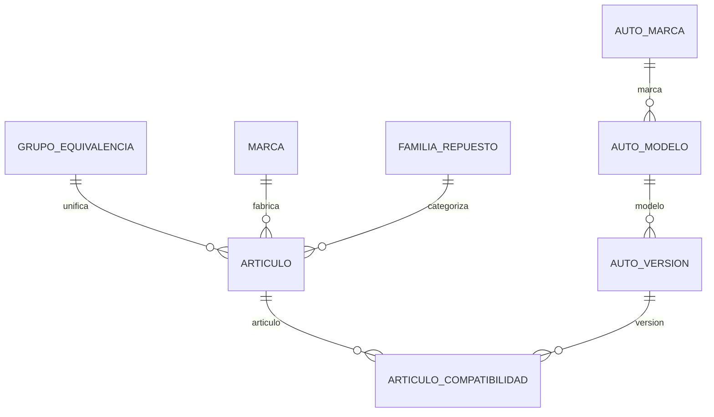

# Especificación Técnica: Catálogo Auto-partista y Búsqueda por Trigramas

Este documento define el diseño formal de base de datos y la estrategia de búsqueda difusa para el catálogo de artículos y compatibilidad de vehículos del ERP.

## 1. Modelo de Datos (PostgreSQL en Supabase)

Para garantizar consistencia y rendimiento eliminando la explosión combinatoria de las equivalencias relacionales, implementamos el patrón de **Grupos de Equivalencia**.



### DDL Schema (SQL)

```sql
-- Habilitar la extensión de trigramas para búsqueda difusa con tolerancia a fallas
CREATE EXTENSION IF NOT EXISTS pg_trgm;

-- 1. Tabla de Marcas de Repuestos
CREATE TABLE IF NOT EXISTS marca (
    id UUID PRIMARY KEY DEFAULT gen_random_uuid(),
    nombre VARCHAR(100) UNIQUE NOT NULL,
    pais_origen VARCHAR(50),
    created_at TIMESTAMP WITH TIME ZONE DEFAULT timezone('utc'::text, now()) NOT NULL
);

-- 2. Tabla de Rubros/Familias de Repuestos
CREATE TABLE IF NOT EXISTS familia_repuesto (
    id UUID PRIMARY KEY DEFAULT gen_random_uuid(),
    nombre VARCHAR(100) UNIQUE NOT NULL,
    descripcion TEXT,
    created_at TIMESTAMP WITH TIME ZONE DEFAULT timezone('utc'::text, now()) NOT NULL
);

-- 3. Tabla de Grupos de Equivalencias (Patrón PIM)
CREATE TABLE IF NOT EXISTS grupo_equivalencia (
    id UUID PRIMARY KEY DEFAULT gen_random_uuid(),
    descripcion VARCHAR(255),
    created_at TIMESTAMP WITH TIME ZONE DEFAULT timezone('utc'::text, now()) NOT NULL
);

-- 4. Tabla de Artículos (Core)
CREATE TABLE IF NOT EXISTS articulo (
    id UUID PRIMARY KEY DEFAULT gen_random_uuid(),
    codigo_fabricante VARCHAR(100) NOT NULL,
    codigo_barras VARCHAR(100),
    descripcion TEXT NOT NULL,
    marca_id UUID NOT NULL REFERENCES marca(id) ON DELETE RESTRICT,
    familia_id UUID NOT NULL REFERENCES familia_repuesto(id) ON DELETE RESTRICT,
    grupo_equivalencia_id UUID REFERENCES grupo_equivalencia(id) ON DELETE SET NULL,
    precio_costo NUMERIC(12, 2) DEFAULT 0.00 NOT NULL,
    precio_minorista NUMERIC(12, 2) DEFAULT 0.00 NOT NULL,
    precio_mayorista NUMERIC(12, 2) DEFAULT 0.00 NOT NULL,
    stock_actual INTEGER DEFAULT 0 NOT NULL,
    stock_minimo INTEGER DEFAULT 5 NOT NULL,
    ubicacion_deposito VARCHAR(100),
    created_at TIMESTAMP WITH TIME ZONE DEFAULT timezone('utc'::text, now()) NOT NULL,
    
    -- Un artículo es único por su código y marca fabricante
    CONSTRAINT uq_articulo_codigo_marca UNIQUE (codigo_fabricante, marca_id)
);

-- 5. Compatibilidad Automotriz: Marcas de Auto
CREATE TABLE IF NOT EXISTS auto_marca (
    id UUID PRIMARY KEY DEFAULT gen_random_uuid(),
    nombre VARCHAR(100) UNIQUE NOT NULL,
    created_at TIMESTAMP WITH TIME ZONE DEFAULT timezone('utc'::text, now()) NOT NULL
);

-- 6. Compatibilidad Automotriz: Modelos
CREATE TABLE IF NOT EXISTS auto_modelo (
    id UUID PRIMARY KEY DEFAULT gen_random_uuid(),
    marca_id UUID NOT NULL REFERENCES auto_marca(id) ON DELETE CASCADE,
    nombre VARCHAR(100) NOT NULL,
    created_at TIMESTAMP WITH TIME ZONE DEFAULT timezone('utc'::text, now()) NOT NULL,
    CONSTRAINT uq_modelo_marca UNIQUE (nombre, marca_id)
);

-- 7. Compatibilidad Automotriz: Versiones / Motorizaciones
CREATE TABLE IF NOT EXISTS auto_version (
    id UUID PRIMARY KEY DEFAULT gen_random_uuid(),
    modelo_id UUID NOT NULL REFERENCES auto_modelo(id) ON DELETE CASCADE,
    motorizacion VARCHAR(100) NOT NULL,
    anio_desde INTEGER NOT NULL,
    anio_hasta INTEGER, -- NULL indica en producción
    created_at TIMESTAMP WITH TIME ZONE DEFAULT timezone('utc'::text, now()) NOT NULL
);

-- 8. Tabla Intermedia Many-To-Many de Compatibilidades
CREATE TABLE IF NOT EXISTS articulo_compatibilidad (
    articulo_id UUID NOT NULL REFERENCES articulo(id) ON DELETE CASCADE,
    auto_version_id UUID NOT NULL REFERENCES auto_version(id) ON DELETE CASCADE,
    observaciones VARCHAR(255),
    PRIMARY KEY (articulo_id, auto_version_id)
);
```

---

## 2. Estrategia de Búsqueda Difusa e Índices GIN

Para asegurar respuestas en `< 5ms` buscando términos combinados con errores ortográficos, implementamos un **Índice de Trigramas GIN** sobre las relaciones.

### Índices FTS/Trigramas
```sql
-- Creamos índices de trigrama en campos clave para acelerar búsquedas aproximadas
CREATE INDEX IF NOT EXISTS idx_articulo_desc_trgm ON articulo USING gin (descripcion gin_trgm_ops);
CREATE INDEX IF NOT EXISTS idx_articulo_codigo_trgm ON articulo USING gin (codigo_fabricante gin_trgm_ops);
```

### Query de Búsqueda Autopartista Inteligente
Para resolver búsquedas desordenadas (ej: `"frenos corven corsa"`), el Backend/SDK divide la frase en `['frenos', 'corven', 'corsa']` y ejecuta:

```sql
SELECT DISTINCT 
    a.id, a.codigo_fabricante, a.descripcion,
    m.nombre AS repuesto_marca,
    f.nombre AS familia_repuesto,
    a.precio_mayorista, a.stock_actual, a.ubicacion_deposito
FROM articulo a
JOIN marca m ON a.marca_id = m.id
JOIN familia_repuesto f ON a.familia_id = f.id
LEFT JOIN articulo_compatibilidad ac ON a.id = ac.articulo_id
LEFT JOIN auto_version av ON ac.auto_version_id = av.id
LEFT JOIN auto_modelo amd ON av.modelo_id = amd.id
LEFT JOIN auto_marca am ON amd.marca_id = am.id
WHERE 
    -- Cada término de búsqueda debe coincidir difusamente con algún atributo
    (
        (a.descripcion ILIKE '%frenos%' OR f.nombre ILIKE '%frenos%' OR m.nombre ILIKE '%frenos%' OR am.nombre ILIKE '%frenos%' OR amd.nombre ILIKE '%frenos%')
        AND
        (a.descripcion ILIKE '%corven%' OR f.nombre ILIKE '%corven%' OR m.nombre ILIKE '%corven%' OR am.nombre ILIKE '%corven%' OR amd.nombre ILIKE '%corven%')
        AND
        (a.descripcion ILIKE '%corsa%' OR f.nombre ILIKE '%corsa%' OR m.nombre ILIKE '%corsa%' OR am.nombre ILIKE '%corsa%' OR amd.nombre ILIKE '%corsa%')
    );
```

---

## 3. Pruebas y Validación (Strict TDD)

Al estar activo el **Strict TDD Mode**, cada consulta de equivalencias o compatibilidades debe validarse con tests automatizados.
*   **Pruebas de Integración (Base de Datos):** Validar que al crear dos artículos bajo el mismo `grupo_equivalencia`, la consulta de equivalencias retorne ambos de forma correcta.
*   **Pruebas Unitarias (Algoritmo de Búsqueda):** Validar que la tokenización de texto y armado dinámico de condiciones SQL se realice de manera correcta en el módulo de búsqueda.
