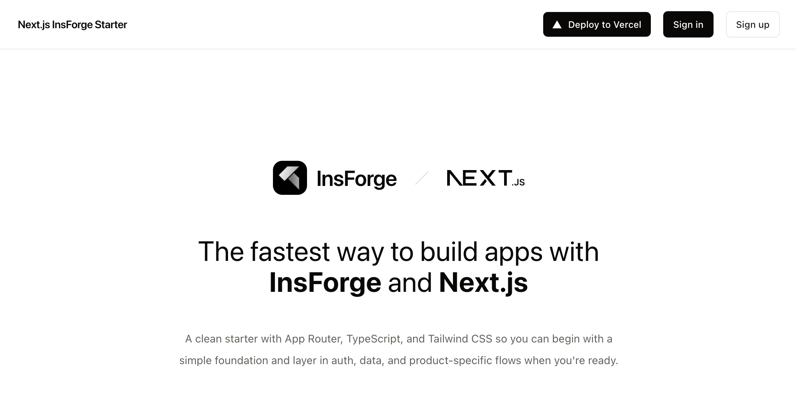

<h1 align="center">Next.js InsForge Starter</h1>

<p align="center">
  The fastest way to build apps with Next.js and InsForge
</p>

<p align="center">
  <a href="#demo"><strong>Demo</strong></a> ·
  <a href="#features"><strong>Features</strong></a> ·
  <a href="#quick-launch"><strong>Quick launch</strong></a> ·
  <a href="#clone-and-run-locally"><strong>Clone and run locally</strong></a> ·
  <a href="#deploy-to-vercel"><strong>Deploy to Vercel</strong></a>
</p>

<p align="center">
  
</p>
<br />

## Demo

Check out the live demo: [demonextjs.insforge.site](https://demonextjs.insforge.site)

## Features

- Works across the [Next.js](https://nextjs.org) App Router stack
  - App Router
  - Client Components
  - Server Components
  - Route Handlers
  - Server Actions
  - It just works
- [InsForge](https://insforge.dev) auth configured to use cookies across the app
- Server-side auth actions using `@insforge/sdk`
- Optional Google and GitHub OAuth providers
- Starter homepage with environment setup guidance
- Protected example route that displays the signed-in user
- Styling with [Tailwind CSS](https://tailwindcss.com)
- Ready for local development and Vercel deployment

## Quick launch

If you want the fastest path, use the InsForge CLI and follow the prompts:

```bash
npx @insforge/cli create
```

From there:

1. Choose the Next.js starter template
2. Follow the prompt flow to create or connect your InsForge project
3. Let the CLI handle the initial setup
4. Choose to deploy with [InsForge](https://insforge.dev) from the guided flow

Use the sections below if you want to set up the starter manually.

## Clone and run locally

1. Clone this repository and move into the starter directory.

```bash
git clone https://github.com/InsForge/insforge-templates.git
cd insforge-templates/nextjs
```

2. Install dependencies.

```bash
npm install
```

3. Go to the [InsForge dashboard](https://insforge.dev), create a project, and click **Connect** → **CLI** to get the link command:

```bash
npx @insforge/cli link --project-id <your-project-id>
```

4. Copy `.env.example` to `.env.local` and update the values with your InsForge project settings (find these in the InsForge dashboard under **Connect** → **API Keys**):

```bash
cp .env.example .env.local
```

Set the following values in `.env.local`:

```env
NEXT_PUBLIC_INSFORGE_URL=https://your-project.region.insforge.app
NEXT_PUBLIC_INSFORGE_ANON_KEY=your-anon-key
NEXT_PUBLIC_APP_URL=https://your-project.insforge.site
```

You can find the project URL and anon key in your InsForge project settings.

5. Start the development server.

```bash
npm run dev
```

The starter should now be running on [localhost:3000](http://localhost:3000).

## Deploy to Vercel

Click [Deploy with Vercel](https://vercel.com/new/clone?repository-url=https%3A%2F%2Fgithub.com%2FInsForge%2Finsforge-templates%2Ftree%2Fmain&root-directory=nextjs&project-name=insforge-nextjs-starter&repository-name=insforge-nextjs-starter&env=NEXT_PUBLIC_INSFORGE_URL,NEXT_PUBLIC_INSFORGE_ANON_KEY,NEXT_PUBLIC_APP_URL&envDescription=Connect%20your%20InsForge%20project%20URL%2C%20anon%20key%2C%20and%20app%20URL.&external-id=https%3A%2F%2Fgithub.com%2FInsForge%2Finsforge-templates%2Ftree%2Fmain%2Fnextjs&demo-title=Next.js%20InsForge%20Starter&demo-description=A%20clean%20Next.js%20starter%20with%20InsForge%20auth%20and%20Tailwind%20CSS.&demo-image=https%3A%2F%2Fraw.githubusercontent.com%2FInsForge%2Finsforge-templates%2Fmain%2Fnextjs%2Fassets%2Fnextjs-starter.png), then fill in the required environment variables during the setup flow:

- `NEXT_PUBLIC_INSFORGE_URL`
- `NEXT_PUBLIC_INSFORGE_ANON_KEY`
- `NEXT_PUBLIC_APP_URL` with your production Vercel URL, for example `https://your-project.vercel.app`

[](https://vercel.com/new/clone?repository-url=https%3A%2F%2Fgithub.com%2FInsForge%2Finsforge-templates%2Ftree%2Fmain&root-directory=nextjs&project-name=insforge-nextjs-starter&repository-name=insforge-nextjs-starter&env=NEXT_PUBLIC_INSFORGE_URL,NEXT_PUBLIC_INSFORGE_ANON_KEY,NEXT_PUBLIC_APP_URL&envDescription=Connect%20your%20InsForge%20project%20URL%2C%20anon%20key%2C%20and%20app%20URL.&external-id=https%3A%2F%2Fgithub.com%2FInsForge%2Finsforge-templates%2Ftree%2Fmain%2Fnextjs&demo-title=Next.js%20InsForge%20Starter&demo-description=A%20clean%20Next.js%20starter%20with%20InsForge%20auth%20and%20Tailwind%20CSS.&demo-image=https%3A%2F%2Fraw.githubusercontent.com%2FInsForge%2Finsforge-templates%2Fmain%2Fnextjs%2Fassets%2Fnextjs-starter.png)

The above will also clone the starter kit to your GitHub, so you can clone it locally and continue development there.
