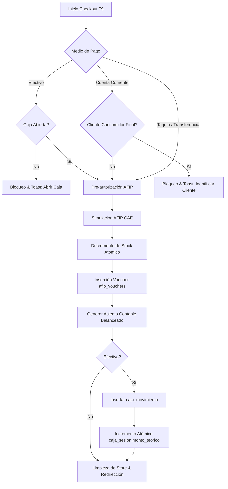

# Walkthrough: Integración de Caja Diaria, Ventas (POS) y Contabilidad de Doble Entrada

Este documento documenta la integración de la terminal de **Punto de Venta (POS / Ventas)** con el módulo de **Caja Diaria** y el **Libro Diario de Contabilidad Jerárquica** bajo los estándares profesionales del proyecto.

---

## 1. Arquitectura de Flujo Transaccional

Cada venta autorizada y emitida a través de la terminal POS ejecuta una secuencia coordinada en la base de datos para garantizar consistencia y balance contable:



---

## 2. Compuertas de Seguridad (Gates) Implementadas

### A. Cash Drawer Gate (Caja Diaria Obligatoria)
Al seleccionar **Efectivo** como medio de pago, el POS verifica de manera transaccional que exista una sesión de caja activa (`caja_sesion.estado === 'abierta'`) para el CUIT de la empresa activa. De lo contrario:
- Se aborta la transacción inmediatamente.
- Se notifica mediante un Toast alertando que es obligatorio abrir la caja diaria.

### B. Nominative Credit Gate (Consumidor Final Block)
El botón de **Cuenta Corriente** se deshabilita de forma reactiva y elegante si el cliente activo es el anónimo **"Consumidor Final"** (`99999999999`). 
- Muestra una indicación visual debajo del botón: `No disp. p/ CF`.
- Posee un tooltip descriptivo: *"La cuenta corriente requiere un cliente identificado, no disponible para Consumidor Final."*
- En el backend / API de guardado, si se intentara evadir la UI, existe una validación redundante que aborta el checkout de inmediato.

### C. Available Credit Limit Gate (Límite de Crédito Activo)
Al realizar una venta en Cuenta Corriente, el POS ejecuta una compuerta transaccional que:
1. Comprueba si el cliente tiene la Cuenta Corriente activa (`tiene_cuenta_corriente === true`).
2. Verifica que el saldo deudor actual más el total del carrito no supere el límite de crédito configurado:
   $$\text{Saldo Actual} + \text{Total Venta} \le \text{Límite de Crédito}$$
3. Si el saldo excede el límite, se bloquea la transacción de inmediato con un Toast descriptivo detallando el límite, saldo disponible y total de compra.

---

## 3. Mapeo Contable de Partida Doble (Ledger Bookings)

El sistema genera asientos contables perfectamente balanceados en el Libro Diario (`accounting_transactions` y `accounting_entries`):

### A. Ventas POS
| Medio de Pago | Código Cuenta (Activo / Crédito) | Detalle de Cuenta | Naturaleza |
| :--- | :--- | :--- | :--- |
| **Efectivo** | `1.1.1.01` | Caja General | Debe (`total_amount`) |
| **Tarjeta** | `1.1.1.02` | Banco Cuenta Corriente | Debe (`total_amount`) |
| **Transferencia** | `1.1.1.02` | Banco Cuenta Corriente | Debe (`total_amount`) |
| **Cuenta Corriente** | `1.1.3.01` | Deudores por Ventas (Clientes) | Debe (`total_amount`) |
| **Ingreso por Ventas** | `4.1.1.01` | Ventas de Repuestos | Haber (`net_amount`) |
| **IVA Débito Fiscal** | `2.1.3.01` | IVA Débito Fiscal (21% / 10.5%) | Haber (`iva_amount`) |

### B. Registrar Cobro (Deuda de Cuenta Corriente)
El cobro de deuda reduce el saldo deudor en la cuenta corriente del cliente e ingresa el dinero a caja o banco:
- **Débito (Debe)**: `1.1.1.01` (Caja General, si es Efectivo) o `1.1.1.02` (Banco Cuenta Corriente, si es Transferencia/Tarjeta).
- **Crédito (Haber)**: `1.1.3.01` (Deudores por Ventas / Clientes) por el monto cobrado.
- *Daily Drawer Sync*: Si el cobro se realiza en **Efectivo**, se requiere caja abierta, insertando un movimiento de ingreso en `caja_movimiento` e incrementando atómicamente el saldo teórico `monto_teorico` en `caja_sesion`.

### Invariante Contable
Antes de impactar la base de datos, el motor realiza una aserción de control:
$$\sum \text{Debe} \equiv \sum \text{Haber}$$
Si la diferencia absoluta excede los $\$0.05$ (tolerancia máxima de redondeo decimal), la transacción completa se revierte con *rollback*.

---

## 4. Verificación Contínua & TDD

### Pruebas Unitarias e Integración (Vitest)
Se crearon pruebas unitarias dedicadas en `cuenta-corriente-gates.test.ts` para testear y documentar todas las reglas de negocio críticas de las Cuentas Corrientes de Clientes y la integración contable:

```bash
 ✓ src/features/inventory/utils/__tests__/inventory-logic.test.ts (21 tests) 5ms
 ✓ src/features/caja/__tests__/use-caja-store.test.ts (3 tests) 3ms
 ✓ src/features/sales/store/__tests__/ventas-checkout-logic.test.ts (3 tests) 2ms
 ✓ src/features/sales/store/__tests__/use-sales-store.test.ts (7 tests) 3ms
 ✓ src/features/customers/__tests__/cuenta-corriente-gates.test.ts (9 tests) 6ms

 Test Files  5 passed (5)
      Tests  43 passed (43)
   Start at  16:08:45
   Duration  261ms
```

### Compilación y Calidad (Build de Producción)
Se validó la consistencia estructural mediante `bun run build` para asegurar compatibilidad absoluta con TypeScript, Next.js y React 19, compilando de forma exitosa en segundos.

---

## 5. Próximos Pasos Recomendados (Manual Verification)

1. **Apertura de Caja**: Ingresar al panel de Caja Diaria (`/protected/caja`), abrir una caja con saldo inicial, y luego ir al POS (`/protected/ventas`) para realizar una venta en Efectivo.
2. **Facturación**: Validar que la venta impacte correctamente la UI de Facturas (`/protected/facturas`).
3. **Cuenta Corriente de Clientes**:
   - Ingresar a `/protected/clientes`, seleccionar un cliente, habilitar su Cuenta Corriente, y definir un límite de $10.000.
   - Ir al POS, comprar por $6.000 en Cuenta Corriente y verificar que se incrementa el Saldo Deudor a $6.000.
   - Intentar comprar por otros $5.000 en Cuenta Corriente y comprobar el bloqueo por límite de crédito excedido.
   - Retornar a Clientes, registrar un cobro por $4.000 (Efectivo) y comprobar la reducción del saldo deudor a $2.000, el registro en movimientos y el ingreso en la caja diaria activa.
4. **Auditoría del Libro Diario**: Ingresar al panel contable (`/protected/contabilidad`) para verificar que los asientos contables de cobros y POS estén perfectamente asentados en partida doble.
